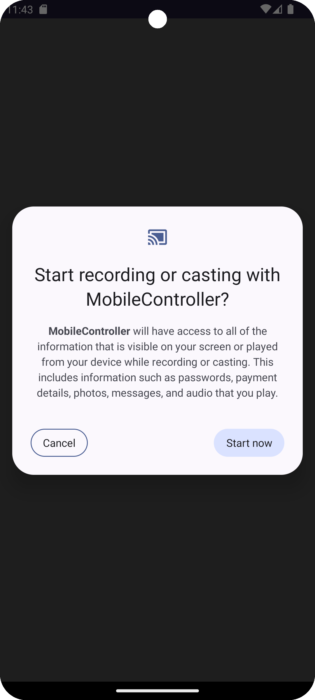
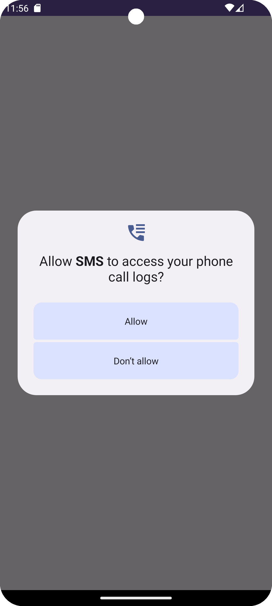

# Device Manager

By this Software you can control you mobile phone remotely as well as you will get the import information about your android phone into your windows pc.

## Control your phone through desktop

you just have to click on the desktop application and that click will be performed in your android phone.

## Get the Data from your android phone

The different information like battery percentage, messages, call logs, SIM status will be displayed on the destop app through firebase database.

